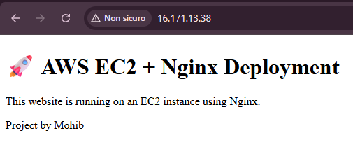
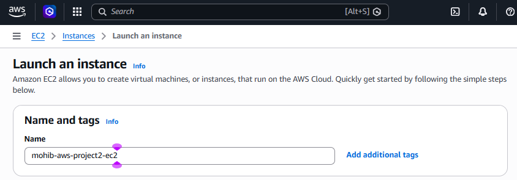
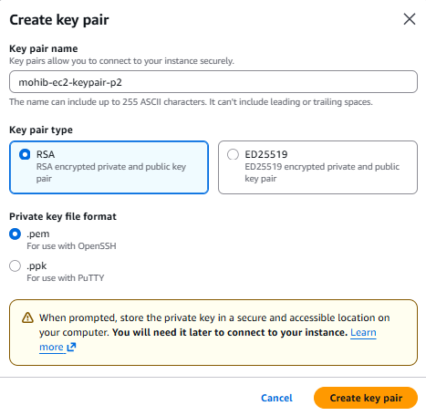
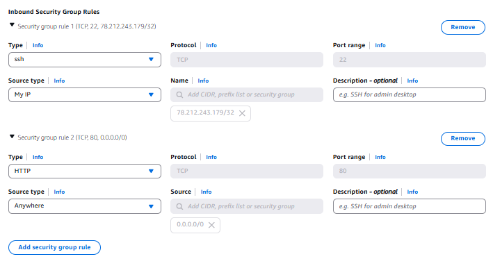
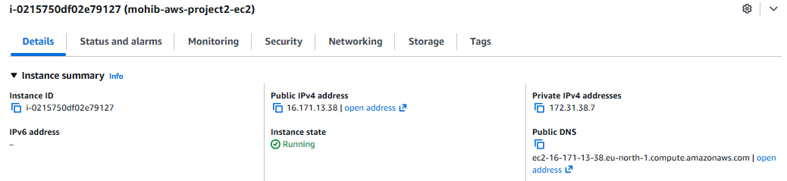
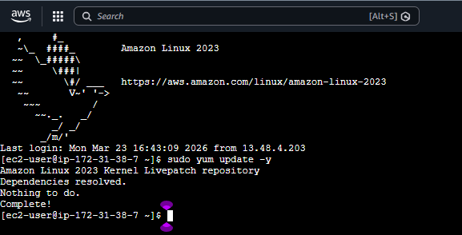
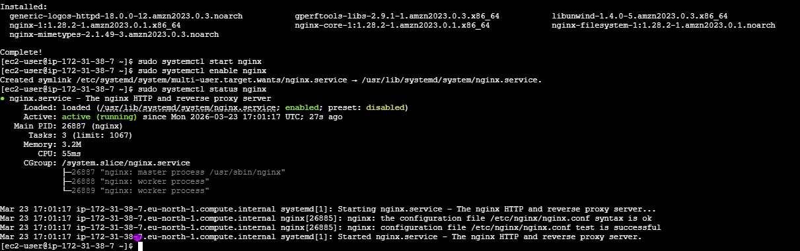
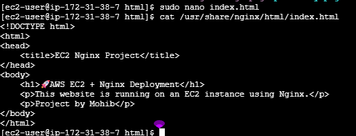

# 🚀 AWS EC2 + Nginx Web Server Project

## 📌 Project Overview

In this project, I created a live website using an AWS EC2 instance and Nginx as a web server.
The goal was to understand how to deploy a website on a real server and make it accessible from the internet.

---

## ⚙️ Step 1: Launching EC2 Instance

I created an EC2 instance with the following configuration:

* Name: mohib-aws-project2-ec2
* OS: Amazon Linux
* Instance type: t3.micro
* Key Pair: RSA key for secure access
* Security Group:

  * SSH (port 22) → My IP
  * HTTP (port 80) → 0.0.0.0/0 (public access)

After configuration, I launched the instance and confirmed it was running.

---

## 🔐 Step 2: Connecting to EC2 (Troubleshooting)

Initially, I was not able to connect to the instance.

The issue was caused by my IP address changing frequently, while the security group allowed only a fixed IP.

To troubleshoot:

* I temporarily changed SSH (port 22) to allow access from anywhere (0.0.0.0/0)
* Then I successfully connected using EC2 Instance Connect (browser-based SSH)

This helped me understand how security groups work as a firewall.

---

## 🖥️ Step 3: Installing Nginx

Once connected to the EC2 instance, I installed and configured Nginx:

```bash
sudo yum update -y
sudo yum install nginx -y
sudo systemctl start nginx
sudo systemctl enable nginx
```

After installation:

* Nginx was active and running
* I verified it by opening the public IP in the browser

---

## 🌐 Step 4: Deploying the Website

I navigated to the Nginx root directory:

```bash
cd /usr/share/nginx/html
```

Then:

* Edited the index.html file
* Replaced the default content with my own HTML code
* Saved the file

---

## 🔧 Step 5: Troubleshooting Website Issue

After deploying the website, I still saw the default Nginx page in the browser.

The issue was caused by browser cache.

To fix it:

* I cleared the browser cache
* Used hard refresh (Ctrl + Shift + R)

After that, the website loaded correctly.

---

## 🌍 Live Website

http://16.171.13.38

---

## 🧠 What I Learned

* How to launch and configure an EC2 instance
* How security groups work as a firewall
* How to connect to a remote server using SSH
* How to install and manage Nginx
* How to deploy a website on a real server
* How to troubleshoot real issues (connection and caching)

---

## 🔧 Problems Solved

* Fixed SSH connection issue caused by changing IP address
* Fixed website loading issue caused by browser cache

---

## 📸 Screenshots

### 🌐 Live Website



### ⚙️ EC2 Instance Creation



### 🔐 Key Pair Creation



### 🛡️ Security Group Configuration



### ☁️ EC2 Running



### 💻 Installing Nginx



### ✅ Nginx Running



### 📁 Nginx Directory


### 📝 HTML Code



## 🌐 Live Website
👉 http://16.171.13.38

## 👨‍💻 Author

Mohib Rizwan     
